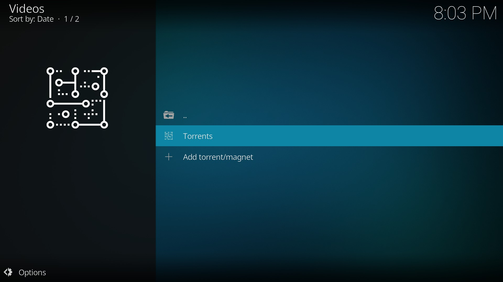

<div align="center">

# ⚡ JackTorr

*An TorrServer streaming addon for Kodi.*

[](https://kodi.tv)
[](LICENSE)
[](https://ko-fi.com/sammax09)

---

[Features](#-features) • [Installation](#-installation) • [Docker Setup](#-docker-setup) • [API Guide](#-api-guide) • [Donations](#-support)

</div>

## 🌟 Overview

**JackTorr** is a high-performance torrent streaming addon for Kodi. It leverages the power of [TorrServer](https://github.com/YouROK/TorrServer) to provide a seamless streaming experience, featuring on-the-fly metadata retrieval, intelligent buffering, and comprehensive playback controls.

---

## ✨ Features

- **🚀 High-Speed Streaming**: Optimized for TorrServer's HTTP API for efficient torrent streaming.
- **📦 Versatile Input**: Support for Magnet links, local `.torrent` files, and direct torrent URLs.
- **📊 Real-time Status**: Optional status overlay showing download speed, active peers, and buffering progress.
- **⚙️ Advanced Buffering**: Configurable pre-load cache and buffering timeouts.
- **📂 Smart File Selection**: Automatically identifies video candidates or lets you choose from multiple files.
- **🔌 API for Addons**: Simple plugin API allows other Kodi addons to trigger JackTorr playback.

---

## 📥 Installation

1.  **Direct Download**: Get the [latest release](https://github.com/Sam-Max/plugin.video.jacktorr/releases/latest).
2.  **Kodi Install**:
    - Go to `Settings` > `Add-ons`.
    - Select `Install from zip file`. (Ensure "Unknown Sources" is enabled).
    - Locate and select the downloaded file.
    
**NOTE**: JackTorr requires an external [TorrServer](https://github.com/YouROK/TorrServer) instance. It does not include the TorrServer daemon itself. You must configure the server address in the addon settings.

---

## 🐳 Docker Setup

The easiest way to run TorrServer is via Docker. Use the following `docker-compose.yml` fragment:

```yaml
version: '3.3'
services:
    torrserver:
        image: ghcr.io/yourok/torrserver
        container_name: torrserver
        environment:
            - TS_PORT=5665
            - TS_DONTKILL=1
            - TS_HTTPAUTH=0
            - TS_CONF_PATH=/opt/ts/config
            - TS_TORR_DIR=/opt/ts/torrents
        volumes:
            - './CACHE:/opt/ts/torrents'
            - './CONFIG:/opt/ts/config'
        ports:
            - '5665:5665'
        restart: unless-stopped
```

---

## 🛠️ API Guide

Developers can integrate JackTorr into their own addons using the following protocol:

| Action | URL Pattern | Description |
| :--- | :--- | :--- |
| **Play Magnet** | `plugin://plugin.video.jacktorr/play_magnet?magnet=<magnet>` | Plays the provided Magnet link |
| **Play URL** | `plugin://plugin.video.jacktorr/play_url?url=<url>` | Plays torrent from a web URL |
| **Play Path** | `plugin://plugin.video.jacktorr/play_path?path=<path>` | Plays torrent from a local file path |

---

## 📸 Screenshots

| Player Interface |
| :---: |
|  |

---

## ☕ Support

If you enjoy using **JackTorr** and want to support its development, you can buy me a coffee!

[](https://ko-fi.com/sammax09)

---

## ⚖️ License

Distributed under the MIT License. See `LICENSE` for more information.

---

<div align="center">
Made with ❤️ for the Kodi Community
</div>
